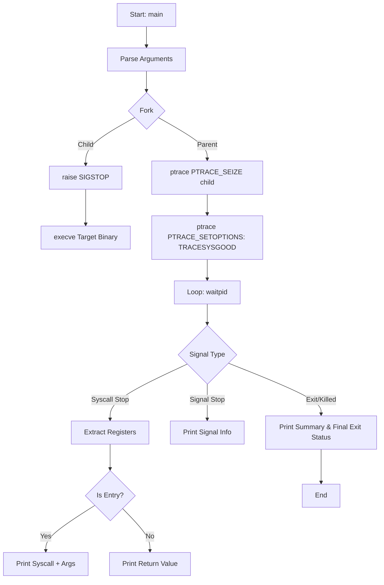

<header>
<h1 align="center">
  <a href="https://github.com/jdecorte-be/ft-strace"></a>
  ft-strace
  <br>
</h1>

<p align="center">
  A lightweight Linux system call tracer that intercepts and records system calls and signals. Features x86_64/i386 support and performance summary reporting.
</p>

<p align="center">
<a href="https://www.42.fr/">
    
  </a>
<a href="https://github.com/jdecorte-be/ft-strace">
    
  </a>
<a href="https://github.com/jdecorte-be/ft-strace">
    
  </a>
<a href="https://github.com/jdecorte-be/ft-strace">
    
  </a>
</p>

<p align="center">
<a href="https://github.com/jdecorte-be/ft-strace">
    
  </a>
  <a href="https://github.com/jdecorte-be/ft-strace">
    
  </a>
  <a href="https://github.com/jdecorte-be/ft-strace/blob/master/LICENSE">
    
  </a>
  <a href="https://github.com/jdecorte-be/ft-strace/stargazers">
    
  </a>
  <a href="https://github.com/jdecorte-be/ft-strace/issues">
    
  </a>
  <a href="https://github.com/jdecorte-be/ft-strace">
    
  </a>
</p>
<p align="center">
  <a href="#overview">Overview</a> •
  <a href="#key-features">Key Features</a> •
  <a href="#architecture">Architecture</a> •
  <a href="#logic-flow">Logic Flow</a> •
  <a href="#system-flowchart">System Flowchart</a> •
  <a href="#prerequisites">Prerequisites</a> •
  <a href="#installation">Installation</a>
</p>
</header>


## Overview

`ft_strace` is a high-performance, low-level diagnostic utility designed to monitor the interaction between a userspace process and the Linux kernel. By leveraging the `ptrace(2)` system call, this tool intercepts and records system calls made by a process and the signals received by it. This implementation is designed to be a functional clone of the classic Linux `strace`, providing deep visibility into application behavior, resource usage, and execution flow.

In modern Linux systems, understanding system call patterns is crucial for debugging performance bottlenecks, identifying security vulnerabilities, and reverse-engineering proprietary binaries. `ft_strace` solves these problems by providing a transparent bridge between the execution environment and the developer, outputting human-readable formats of raw kernel data.

## Key Features

- **Dual-Architecture Support (x86_64 & i386)**: Automatically detects the process architecture by inspecting the Code Segment (`cs`) register. It maintains separate syscall tables for 32-bit and 64-bit execution paths, ensuring accurate reporting even on multi-arch systems.
- **Deep Argument Inspection**: Unlike simple tracers that only show raw hex values, `ft_strace` decodes:
  - **Strings**: Reads process memory to display actual string content.
  - **Open Flags**: Converts bitmask integers into symbolic names (e.g., `O_RDWR|O_CREAT`).
  - **Signals**: Identifies Linux signals by name (e.g., `SIGINT`, `SIGSEGV`) and decodes `siginfo_t` structures.
  - **Arrays**: Formats `argv` and `envp` structures.
- **Summary Statistics Mode (`-c`)**: Provides a high-level performance profile of a binary by aggregating:
  - Execution time per system call (using `clock_getcpuclockid`).
  - Total number of calls.
  - Error count per syscall.
- **Path Resolution**: Emulates shell behavior by searching the `PATH` environment variable for executables if a relative path isn't provided.
- **Signal Interception**: Captures and reports signals that interrupt the tracee, providing context on why a process might have crashed or stopped.

## Architecture

`ft_strace` follows a classic Tracer/Tracee architecture using the Linux `ptrace` API. 

### Logic Flow
1. **Initialization**: The parent process forks. The child process sets up its environment and raises `SIGSTOP` to allow the parent to attach.
2. **Attachment**: The parent uses `PTRACE_SEIZE` and `PTRACE_INTERRUPT` to gain control over the child without forcibly stopping it in an inconsistent state.
3. **Event Loop**: The tracer enters a `waitpid` loop, resuming the tracee with `PTRACE_SYSCALL` to stop at every entry and exit point of a system call.
4. **Data Extraction**: Using `PTRACE_GETREGSET`, the tracer extracts register values (`rax`, `rdi`, `rsi`, etc.) to determine the syscall number and its arguments.
5. **Decoding**: The tool maps syscall numbers to names and types using internal tables, then prints the formatted output to `stderr`.

### System Flowchart


## Prerequisites

- **OS**: Linux (Targeted at x86_64 architectures).
- **Compiler**: `gcc` (support for C99/C11).
- **Headers**: Linux kernel headers (specifically `sys/ptrace.h`, `sys/user.h`, and `elf.h`).
- **Environment**: Root or `CAP_SYS_PTRACE` capabilities may be required depending on kernel security settings (`/proc/sys/kernel/yama/ptrace_scope`).

## Installation

Clone the repository and compile using the provided `Makefile`:

```bash
git clone https://github.com/your-repo/ft_strace.git
cd ft_strace
make
```

**Expected Output:**
```text
Compiling: srcs/main.c
Compiling: srcs/strace.c
...
Linking: ft_strace
Build complete!
```

## Usage Guide

### Basic Tracing
To trace a simple command like `ls`:
```bash
./ft_strace /bin/ls
```

### Summary Mode
To get a performance report of a process:
```bash
./ft_strace -c /usr/bin/find . -name "*.c"
```

### Tracing with Arguments
Pass arguments to the target binary as you normally would:
```bash
./ft_strace /usr/bin/grep "hello" test.txt
```

### Function Documentation (Internal API)
- `trace_bin(t_strace *strace)`: The heart of the program. Manages the `waitpid` loop and dispatches events.
- `handle_syscall(...)`: Dispatches logic based on architecture, maps registers to arguments, and manages the `is_entry` state machine.
- `print_string(pid_t pid, void *addr)`: Safely reads the memory of the tracee using `process_vm_readv` to print string arguments without crashing the tracer.

## Troubleshooting

| Issue | Cause | Solution |
| :--- | :--- | :--- |
| `ptrace seize failed` | Already being traced or insufficient permissions. | Ensure no other tracer is attached and check `ptrace_scope`. |
| `Unknown architecture` | Binary is neither x86_64 nor i386. | `ft_strace` currently only supports these two architectures. |
| Empty output | Binary is statically linked or crashes immediately. | Check the binary with `file` command; try tracing `ls` to verify tracer health. |
| `ENOENT` | Binary not in `PATH` and no absolute path given. | Provide the full path (e.g., `/bin/ls` instead of `ls`). |

## Roadmap

- [ ] **Architecture Support**: Add support for ARM64 architectures.
- [ ] **Instruction Pointer Tracking**: Add the `-i` flag to print the instruction pointer at the time of the syscall.
- [ ] **File Descriptor Tracking**: Implement `-y` to display paths associated with file descriptor arguments.
- [ ] **Multi-threading**: Implement support for tracing cloned processes/threads using `PTRACE_O_TRACECLONE`.
- [ ] **Signal Filtering**: Allow users to hide specific signals from the output.

## License

Distributed under the MIT License. See `LICENSE` for more information.
